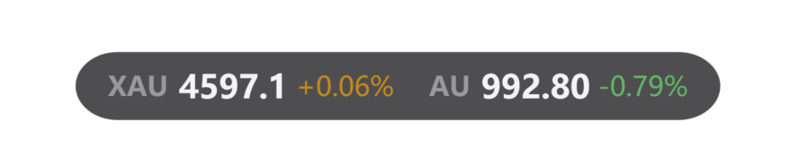
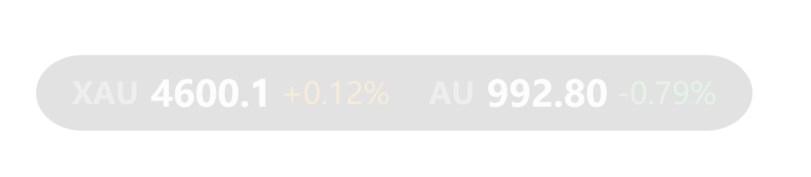
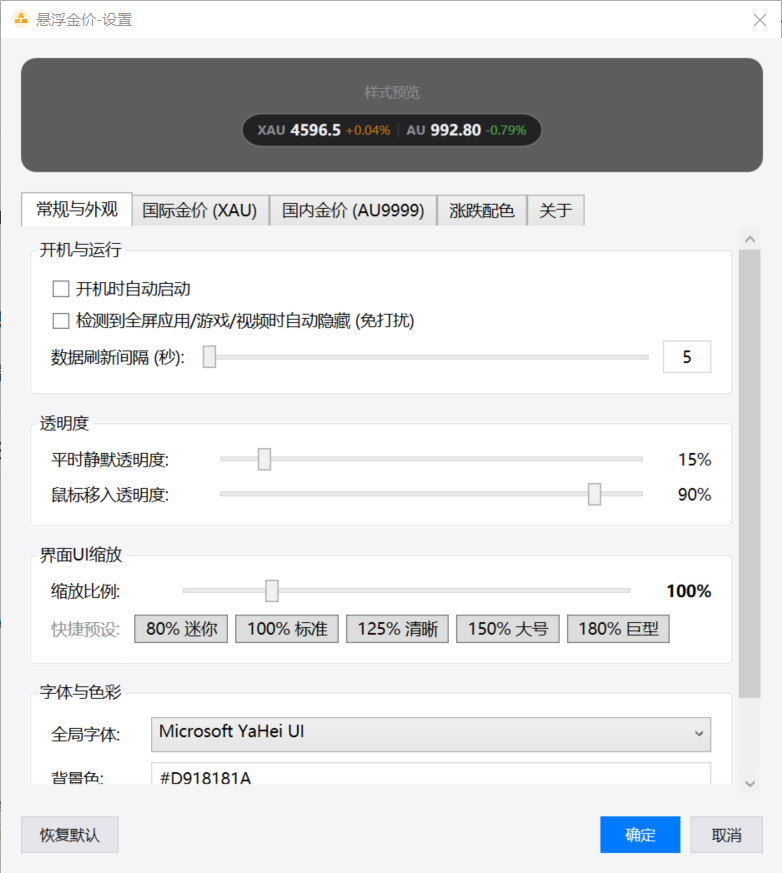
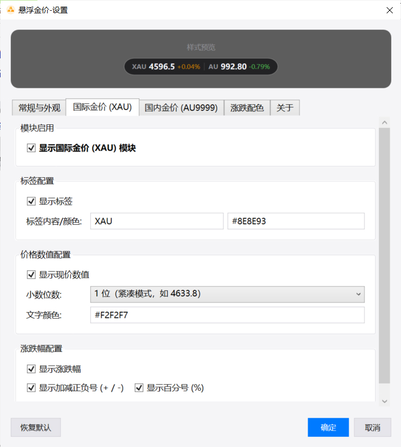

# GoldMonitor 金价胶囊

**极简、优雅、低占用的 Windows 桌面实时黄金价格监控悬浮窗**

[-success)](https://github.com/echo-jianyu/GoldMonitor/releases)

  <a href="#-核心特性">核心特性</a> •
  <a href="#-快速下载使用">快速下载</a> •
  <a href="#️-设置面板预览">设置预览</a> •
  <a href="#️-技术架构">技术架构</a> •
  <a href="#-免责声明">免责声明</a>

<!-- 悬浮胶囊效果图展示 -->

   
  <em style="color: #888; font-size: 12px;">鼠标移入 / 常态清晰显示</em>  
   
  <em style="color: #888; font-size: 12px;">平时静默潜伏 / 半透明不遮挡</em>

---

## ✨ 核心特性

- 🪙 **双盘行情实时同步**：同时支持 **伦敦现货黄金 (XAU/USD)** 与 **上海黄金交易所 (Au99.99)** 实时行情、昨收比对与涨跌幅计算。
- 🍃 **极致绿色单文件**：仅一个独立 `.exe`（约 2MB），**无需安装任何 .NET 运行时**，在纯净 Windows 10 / 11 电脑上双击秒开。
- 🪟 **圆角胶囊美学设计**：深色拟态极简胶囊，支持矢量等比无级缩放（0.5x ~ 3.0x），在高分辨率 2K/4K 屏上依然细腻清晰。
- 👻 **低调潜伏 & 移入渐显**：支持静默透明度与鼠标悬浮高亮平滑过渡，随心拖拽，自动记忆屏幕坐标。
- 🎮 **智能全屏免打扰**：全屏游戏（DirectX/3D）、全屏视频播放或 PPT 演讲时**自动隐藏**，不遮挡视线、不抢焦点。
- 🎨 **高度个性化定制**：
  - 支持多套经典涨跌配色（柔金/翡翠、国内红涨绿跌、国际绿涨红跌及任意自定义 HEX 颜色）。
  - 支持自定义字体、背景色、边框色、小数显示位数与标签文字。
  - 支持独立开关国际金价/国内金价模块。

---

## 🚀 快速下载使用

### 下载运行
1. 前往 **[Releases 页面](https://github.com/echo-jianyu/GoldMonitor/releases)** 下载最新版 `悬浮金价.exe`；
2. 放置在电脑任意目录，**双击即可直接运行**，无需安装，即点即用。

### 快捷操作
| 操作 | 对应功能 |
| :--- | :--- |
| **鼠标左键按住拖动** | 自由移动悬浮胶囊到屏幕任意位置（松开自动记忆位置） |
| **鼠标悬浮移入** | 自动平滑过渡到高亮透明度，清晰查看行情 |
| **鼠标右键单击** | 弹出快捷菜单（进入设置、立即刷新行情、退出程序） |

---

## ⚙️ 设置面板预览

软件内置全功能可视化配置中心，所有个性化调整均配备**实时效果预览**：

  
  &nbsp;&nbsp;
  

- **开机与常规**：开机自启动、全屏应用自动隐藏、数据刷新间隔（1~300秒）。
- **外观透明度**：静默时的透明度、鼠标悬停时的透明度、全局 UI 缩放比例微调。
- **行情与色彩**：独立控制标签内容、现价小数位数、正负号显示、自定义涨跌平盘颜色。

---

## 🛠️ 技术架构

- **UI 框架**：WPF (Windows Presentation Foundation)
- **目标框架**：.NET Framework 4.8 (Windows 原生内置，零依赖)
- **MVVM 架构**：[CommunityToolkit.Mvvm](https://github.com/CommunityToolkit/dotnet)
- **单文件打包**：[Costura.Fody](https://github.com/Fody/Costura)

---

## 📌 免责声明

1. 本软件为开源个人桌面小工具，行情数据来源于新浪财经等公开网络接口。
2. 数据展示可能存在微小网络延迟，**仅供个人行情参考，不构成任何投资建议或交易依据**。
3. 开发者不对因使用本软件造成的任何直接或间接投资损失承担责任。

---

## 📄 开源协议

本项目采用 [MIT License](LICENSE.txt) 开源许可证。

欢迎提交 [Issues](https://github.com/echo-jianyu/GoldMonitor/issues) 反馈 Bug 或提出新功能建议！  
如果这个小工具对你有帮助，不妨点一个 **Star ⭐** 支持一下开发者！